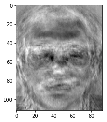

# Homework 2

## 1. Convert an image to vector and reconstruct the image with the vector


```python
### import packages and set the default directory
import numpy as np
import random
from PIL import Image
import os
import matplotlib.pyplot as plt
%matplotlib inline
os.chdir("C:/Users/yipinl/Data Visualization/FACESdata/")
```

### Convert an image to vector


```python
fullpath = "s1/10.pgm"
img = Image.open(fullpath).convert('L')
imagearray = np.array(img)
original_shape = imagearray.shape
flat = imagearray.ravel()
facevector = np.matrix(flat)
print("The original shape is", original_shape)
print(facevector,"\nThe size of vector is", facevector.shape)
```

    The original shape is (112, 92)
    [[34 34 33 ... 37 40 33]] 
    The size of vector is (1, 10304)
    

### Reconstruct the image


```python
face_example = np.asarray(facevector.reshape(original_shape))
face_example_img = Image.fromarray(face_example, 'L')
face_example_img.show()
face_example_img.save("results/FaceExampleOutput.jpg")
```

## 2. convert each face in the dataset

### Used paths to store all paths for figures and convert these pictures to a facematrix


```python
paths = []

for i in range(1,41):
    for j in range(1,11):
        fullpath = "s"+str(i)+"/"+str(j)+".pgm"
        paths.append(fullpath)
        img = Image.open(fullpath).convert('L')
        imagearray = np.array(img)
        flat = imagearray.ravel()
        facevector = np.matrix(flat)
        if i == 1 and j == 1:
            facematrix = facevector
        else:
            facematrix = np.r_[facematrix,facevector]
```


```python
facematrix.shape
```


    (400, 10304)


### 3. Transpose the matrix if needed so that the COLUMNS are the faces. 


```python
facematrix_t = np.transpose(facematrix)
print(facematrix_t)
print(facematrix_t.shape)
```

    [[ 39  60 131 ... 125 119 125]
     [ 44  60 129 ... 119 120 124]
     [ 53  62 130 ... 124 120 124]
     ...
     [ 29  32  51 ...  36  89  36]
     [ 26  34  48 ...  39  94  35]
     [ 29  34  55 ...  40  85  34]]
    (10304, 400)
    

## 4.  Find the mean of all the columns and subtract that mean from all the columns to form a normalized face matrix.


```python
## Show the mean face
mean_face = np.int16(facematrix_t.mean(axis = 1))
mean_face_arrary = np.asarray(mean_face.reshape(original_shape))
facemean_img = plt.figure()
plt.imshow(mean_face_arrary, cmap = plt.get_cmap("gray"))
plt.axis("off")
plt.show()
facemean_img.savefig('results/mean_face.jpg')
```


```python
mean_face_arrary
```


    numpy.ndarray


### Subtract that mean from all the columns to form a normalized face matrix


```python
A = (facematrix_t - mean_face)
A_T = A.transpose()
```

## 5. Perform the appropriate Turk and Pentland method for PCA to determine the eigenvectors and eigenvalues of the covariance matrix. (See the slides and take the cov of the normalized matrix).

### Acccording to the slides and the paper, the covariance matrix is the product of $A^TA$. Hence, we can show that.


```python
CovMatrix = np.matmul(A_T, A)
print("The covar matrix is \n", CovMatrix)
print("The shape of covar matrix is \n", CovMatrix.shape)
```

    The covar matrix is 
     [[ 23278    774  15890 ...  28310 -18213  28164]
     [   774   8338 -30327 ...    569  25326  16297]
     [ 15890 -30327 -10552 ... -12161 -14225 -30304]
     ...
     [ 28310    569 -12161 ...  28555  -1488   6416]
     [-18213  25326 -14225 ...  -1488  32450 -19965]
     [ 28164  16297 -30304 ...   6416 -19965   8090]]
    The shape of covar matrix is 
     (400, 400)
    

### Calculate the eigenvalues and the eigenvectors


```python
evals, evects = np.linalg.eig(CovMatrix)
evals=evals.real
evects=evects.real
print("The first 10 eigenvalues are", evals[0:10])
print("\nThe first 10 eigenvectors are",evects[0:10])
```

    The first 10 eigenvalues are [765599.24143942 734961.12171039 726973.48949618 713341.4759108
     701873.78779    694841.70970805 690066.2576519  687303.45959896
     680103.72243073 671239.38651102]
    
    The first 10 eigenvectors are [[ 2.77530113e-02  3.74323886e-02 -5.05955855e-02 ...  3.50351313e-02
      -3.34035312e-02  1.15789716e-15]
     [-4.58059553e-02 -1.71322485e-02  2.39287222e-02 ...  7.83426687e-03
       1.01122589e-01  1.14978528e-15]
     [ 1.11554939e-01 -8.39798331e-02 -2.38986656e-02 ...  9.89952244e-03
      -3.87114364e-02  7.07106781e-01]
     ...
     [-5.91112852e-02  3.48732065e-02 -7.05907025e-02 ...  8.78994009e-02
       1.47081016e-02  1.68592680e-15]
     [-2.54289524e-03  9.55327637e-02 -2.23768968e-02 ...  2.57912801e-02
      -3.06538747e-02 -1.64374657e-15]
     [ 8.40931715e-02  1.94268377e-02  7.63204669e-03 ...  5.07240548e-02
       9.98361341e-03 -1.78290963e-15]]
    

## 6/7/8. Order the eigenvalues. Choose the top k eigenvalues, where k is less than 400 AND where k can be any choice of the User

### Use argsort function to order the eigenvalues and eigenvectors


```python
idx = evals.argsort()[::-1]   
evals = evals[idx]
evects = evects[:,idx]
for i in range(3):
    print("The %d eigenvalue is %.3f \n" % (i+1, evals[i]))
    print("The", str(i+1) ,"eigenvector is\n",evects)
```

    The 1 eigenvalue is 765599.241 
    
    The 1 eigenvector is
     [[ 0.02775301  0.03743239 -0.05059559 ...  0.01950506 -0.00652215
      -0.05948352]
     [-0.04580596 -0.01713225  0.02392872 ... -0.03181621 -0.0814406
       0.00031454]
     [ 0.11155494 -0.08397983 -0.02389867 ... -0.06952944 -0.08649817
       0.23534061]
     ...
     [-0.00254874  0.00746056  0.05745882 ... -0.01032147  0.02264857
      -0.01893862]
     [-0.06636266  0.01529674  0.07970803 ... -0.05897133 -0.04505964
       0.0247299 ]
     [ 0.00827991 -0.01394839 -0.01384388 ... -0.0633304  -0.01829569
       0.12557653]]
    The 2 eigenvalue is 734961.122 
    
    The 2 eigenvector is
     [[ 0.02775301  0.03743239 -0.05059559 ...  0.01950506 -0.00652215
      -0.05948352]
     [-0.04580596 -0.01713225  0.02392872 ... -0.03181621 -0.0814406
       0.00031454]
     [ 0.11155494 -0.08397983 -0.02389867 ... -0.06952944 -0.08649817
       0.23534061]
     ...
     [-0.00254874  0.00746056  0.05745882 ... -0.01032147  0.02264857
      -0.01893862]
     [-0.06636266  0.01529674  0.07970803 ... -0.05897133 -0.04505964
       0.0247299 ]
     [ 0.00827991 -0.01394839 -0.01384388 ... -0.0633304  -0.01829569
       0.12557653]]
    The 3 eigenvalue is 726973.489 
    
    The 3 eigenvector is
     [[ 0.02775301  0.03743239 -0.05059559 ...  0.01950506 -0.00652215
      -0.05948352]
     [-0.04580596 -0.01713225  0.02392872 ... -0.03181621 -0.0814406
       0.00031454]
     [ 0.11155494 -0.08397983 -0.02389867 ... -0.06952944 -0.08649817
       0.23534061]
     ...
     [-0.00254874  0.00746056  0.05745882 ... -0.01032147  0.02264857
      -0.01893862]
     [-0.06636266  0.01529674  0.07970803 ... -0.05897133 -0.04505964
       0.0247299 ]
     [ 0.00827991 -0.01394839 -0.01384388 ... -0.0633304  -0.01829569
       0.12557653]]
    

### Order the eigenvalues. Choose the top k eigenvalues. Notice that the first k eigenvectors are the first k principal components. 

### Create a matrix of the projected k eigenvectors by multiplying A and the matrix consisting of first k eigenvectors. I used k = 25 in this case.


```python
k = int(input("Please input the number of K: "))
eigenface_matrix = np.matmul(A, evects[:,0:k])
print("The projected eigenface matrix is",eigenface_matrix)
```

    Please input the number of K: 25
    The projected eigenface matrix is [[ 22.07028184 -45.09545926  15.38195015 ... -16.13950755  17.18319876
      -27.66020431]
     [ 22.22814371 -39.2275273   14.34023343 ... -24.14356173  14.49410735
      -25.11623362]
     [ 19.82419396 -38.62718176  16.17611175 ... -19.23376128  17.93478051
      -27.55768254]
     ...
     [-63.58906553  14.77978995 -58.84190439 ...  -3.38163221  -3.58217948
       76.25294658]
     [-62.38791365  16.46094517 -43.80964065 ... -16.51319958  -2.79159404
       44.13232079]
     [-76.30789064  13.6396729   -7.64175636 ...  -6.46312361  31.61038793
       19.20898489]]
    

### Project the k eigenvectors back into the original space. Create a matrix of the projected k eigenvectors. These k eigenvectors are called EIGENFACES and the matrix is the eigenface_matrix


```python
print("Top 5 eigenfaces")
for i in range(5):
    figure = plt.figure()
    plt.imshow(eigenface_matrix[:,i].reshape(original_shape), cmap = plt.get_cmap("gray"))
    plt.show()
    figure.savefig('results/'+str(i+1) +"_eigenface.jpg")
```

    Top 5 eigenfaces
    





## Test 1

### Randomly select a picture


```python
fig_idx = random.randint(0, 399)
fig_path = paths[fig_idx]
print("Test_Image path:", fig_path)
```

    Test_Image path: s26/7.pgm
    


```python
img=Image.open(fig_path).convert('L')
img.show()
img.save("results/TEST_Image.pgm")
imagearray = np.array(img)
```


```python
test1 = plt.figure()
plt.imshow(img, cmap = plt.get_cmap("gray"))
plt.axis("off")
plt.show()
test1.savefig("results/TEST_Image_1.jpg")
```


### Project the test vector to the eigenface


```python
flat = imagearray.ravel()
test_vector = np.matrix(flat) - mean_face.ravel()
test_proj = np.matmul(eigenface_matrix.T, test_vector.T)
all_proj = np.matmul(eigenface_matrix.T, A)
```

### Calculate the distance between the test face and all faces. The closest face has the smallest distance.


```python
distances = np.square(all_proj - test_proj).sum(axis = 0)
closest_idx = int(distances.argsort()[::-1][:,0])
closest_path = paths[closest_idx]
```

### The algorithm can find the original test picture


```python
print("The closest file is",closest_path)
```

    The closest file is s26/7.pgm
    


```python
img=Image.open(closest_path).convert('L')
img.show()
img.save("results/TEST1_Similar_Image.pgm")
```


```python
test1_projected = plt.figure()
plt.imshow(img, cmap = plt.get_cmap("gray"))
plt.axis("off")
plt.show()
test1_projected.savefig("results/PREDICTED_Image_1.jpg")
```


## Test 2


```python
fig_idx = random.randint(0, 399)
fig_path = paths[fig_idx]
print("Test_Image path:", fig_path)
```

    Test_Image path: s3/3.pgm
    


```python
img=Image.open(fig_path).convert('L')
img.show()
img.save("results/TEST_Image_2.pgm")
imagearray = np.array(img)
```


```python
test2 = plt.figure()
plt.imshow(img, cmap = plt.get_cmap("gray"))
plt.axis("off")
plt.show()
test2.savefig("results/TEST_Image_2.jpg")
```


```python
if fig_idx == 0:
    facematrix[fig_idx,:] = facematrix[399,:]
else:
    facematrix[fig_idx,:] = facematrix[1,:]
```


```python
facematrix_t = np.transpose(facematrix)
mean_face = np.int16(facematrix_t.mean(axis = 1))
mean_face_arrary = np.asarray(mean_face.reshape(original_shape))
A = (facematrix_t - mean_face)
A_T = A.transpose()
CovMatrix = np.matmul(A_T, A)
evals, evects = np.linalg.eig(CovMatrix)
evals=evals.real
evects=evects.real
idx = evals.argsort()[::-1]   
evals = evals[idx]
evects = evects[:,idx]
eigenface_matrix = np.matmul(A, evects[:,0:k])
flat = imagearray.ravel()
test_vector = np.matrix(flat) - mean_face.ravel()
test_proj = np.matmul(eigenface_matrix.T, test_vector.T)
all_proj = np.matmul(eigenface_matrix.T, A)
distances = np.square(all_proj - test_proj).sum(axis = 0)
closest_idx = int(distances.argsort()[::-1][:,0])
closest_path = paths[closest_idx]
```


```python
print("The closest picture is", closest_path)
```

    The closest picture is s3/2.pgm
    


```python
img=Image.open(closest_path).convert('L')
img.show()
img.save("results/TEST2_Similar_Image.pgm")
```


```python
print("The closest file is", closest_path)
```

    The closest file is s3/2.pgm
    


```python
test2_projected = plt.figure()
plt.imshow(img, cmap = plt.get_cmap("gray"))
plt.axis("off")
plt.show()
test2_projected.savefig("results/PREDICTED_Image_2.jpg")
```


